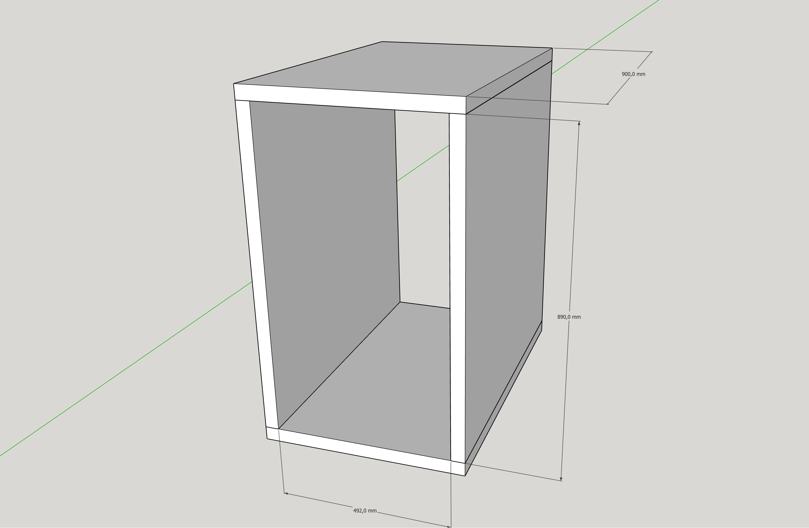
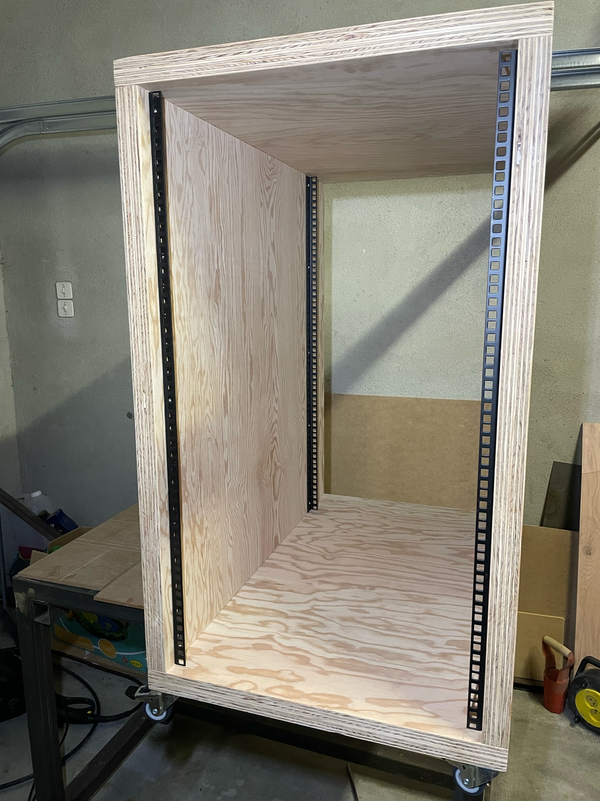
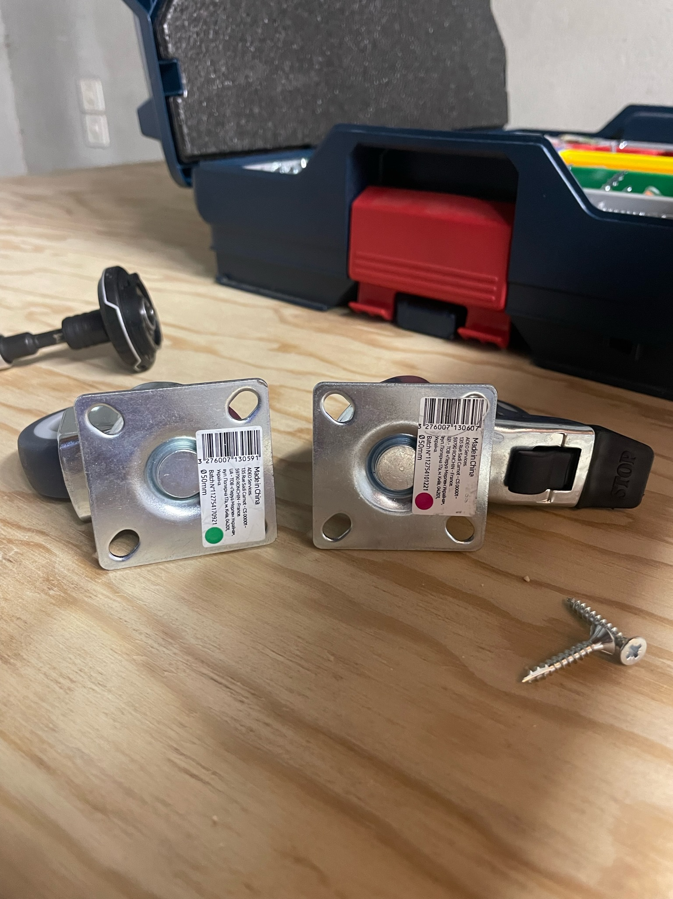
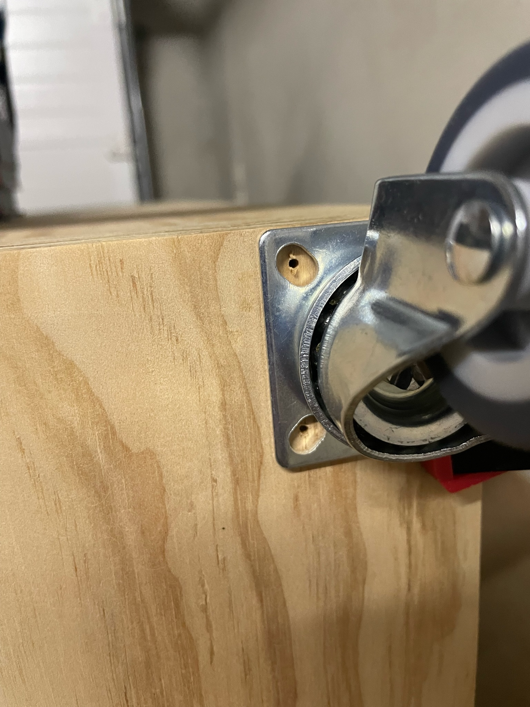
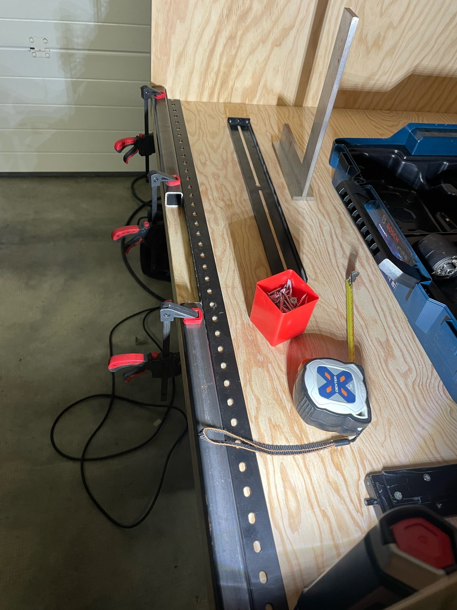
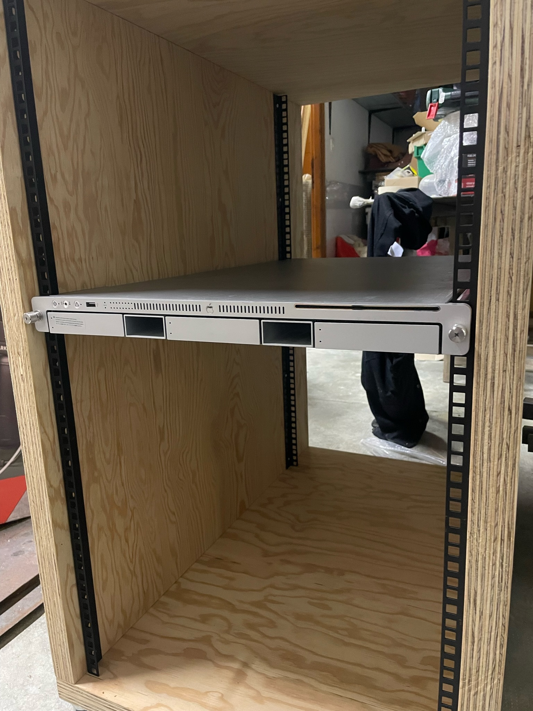
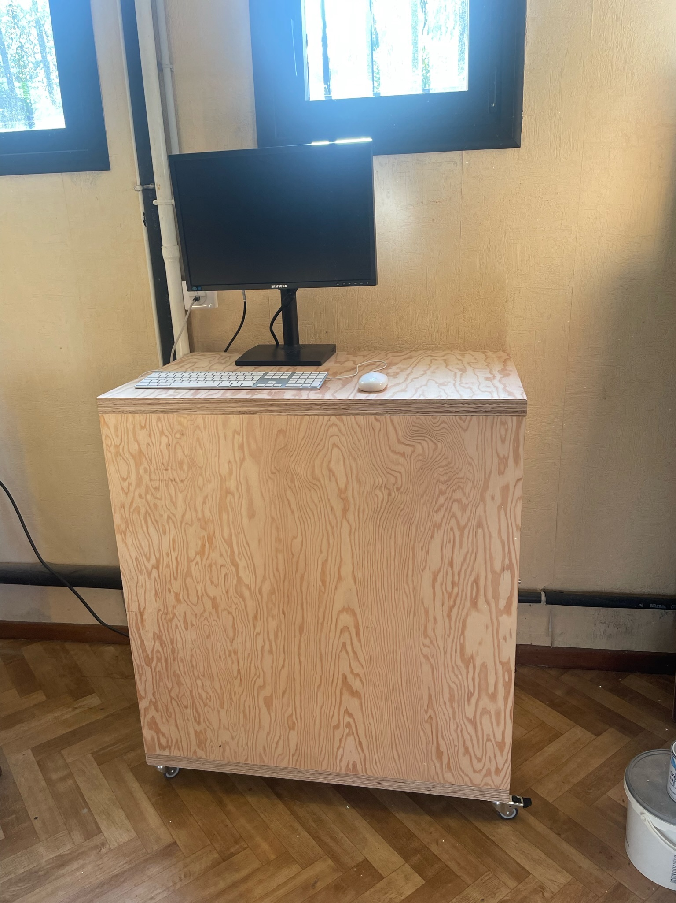

Il me fallait une baie serveur pour mettre mes Apple Xserve, quand j'ai vu les prix des baies serveurs 20U ou plus, j'ai tout de suite décidé de la faire moi-même en bois.

<!-- more -->

J'ai donc commencé par chercher des rails à trous carrés pour faire les montants, j'ai trouvé des rails de la marque [Adam Hall 61535 B 20](https://www.bax-shop.fr/pieces-pour-flight-case/adam-hall-61535b20-heavy-duty-rack-strip-profile-rack-noir-20u) pour 6,20€ l'unité (en 2022), il en faut 4 pour faire une baie serveur de 20U, soit 24,80€.

Ensuite, j'ai fait le plan 3D sur SketchUp (lien vers le fichier à la fin de l'article), en me basant sur les dimensions des rails.

Je suis parti sur du contreplaqué de 19 mm d'épaisseur que j'ai doublé pour avoir une épaisseur de 38 mm, probablement un peu trop épais, mais au moins ça ne bouge pas, vu le poids des Xserve.

J'ai la chance d'avoir un ami menuisier à qui j'ai délégué la fabrication (oui, je n'avais pas trop le temps, ni le bois), il a donc coupé les pièces et les a assemblées.

Il m'a livré la baie sans rails ni roulette, je m'en suis occupé moi-même.

Voici quelques photos du montage des rails et des roulettes.

Désolé, je n'ai pas les photos de l'assemblage de la baie.

 

J'ai pré-percé avec une mèche de 3 mm pour que les vis n'éclatent pas le bois.

  

Comme vous pouvez le voir sur la photo, la hauteur est parfaite pour y poser un clavier, souris et écran.

Voici le lien pour télécharger le [plan 3D SketchUp 2017](/files/rack-server-v2.skp).
