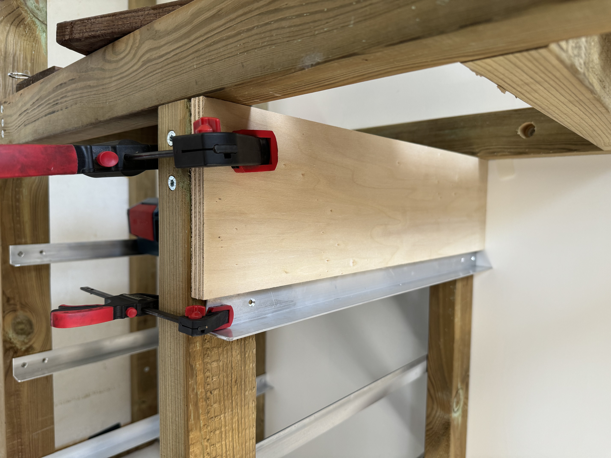

Suite à la rénovation de ma maison, j'ai accumulé pas mal d'outils, que j'avais stocké sur des étagères faites sur mesure par mon grand-père (il y a plus de 30 ans...).

J'ai dû faire l'isolation du mur de mon atelier (qui n'était pas isolé), du coup les étagères ne rentré plus... c'est l'occasion de me faire un établi sur mesure pour mon atelier et de ranger mes outils correctement.

Objectif, avoir un plan de travail assez grand pour pouvoir travailler confortablement et pouvoir poser des machines (imprimante 3D, scie à chantourner, etc), des tiroirs pour avoir du rangement et des emplacements pour poser des caisses de rangement Bosch L-Boxx.

<!-- more -->

## Conception

J'ai utilisé [SketchUp](https://www.sketchup.com/fr) pour la conception de mon établi (plus besoin de le présenter...).

Comme d'habitude, j'ai modélisé mon atelier pour avoir une idée de la taille de l'établi et de son emplacement, ainsi que les emplacements des prises électriques.

## Matériaux

Pour le plateau, j'ai utilisé du panneau lamellé-collé Hévéa en 22 mm, j'ai pris un panneau de 4500x1100 mm.

Pour la structure, j'ai utilisé du pin en 45x70x5000 mm pour les pieds et les traverses (x 8).

Pour les tiroirs, j'ai utilisé du contreplaqué peuplier en panneau 2500x1220 mm (x 3).

Pour les rails de tiroirs, j'ai utilisé des cornières en alu de 30x30 mm en 2 mm d'épaisseur en 6000 mm de long (x 6).

Pour gérer mes plans de découpe, j'ai utilisé [opticutter](https://www.opticutter.com/).

Voici un aperçu des plans de découpe pour les différents matériaux.

Le prix total des matériaux (bois uniquement) est d'environ 642 €.

## Fabrication

J'ai la chance d'avoir un ami menuisier qui s'est occupé de récupérer le bois et des découpes ce qui m'a bien aidé !

### Assemblage des pieds

J'ai commencé par assembler les pieds de l'établi, j'ai utilisé des vis à bois de 6x100 mm pour l'assemblage.

Pour ce faire, j'ai mis en place un gabarit pour avoir un assemblage parfait et reproductible, le 1ᵉʳ pied a été long à faire, mais les autres ont été plus rapides.

J'ai été un peu trop overkill sur le nombre de vis, j'ai mis 2 vis par assemblage, comme ça j'étais sûr que ça ne bougerait pas.

### Assemblage des montants de la colonne

J'ai ensuite assemblé les montants de la colonne, c'est le même principe que pour les pieds.

### Assemblage de la structure du plateau

J'ai ensuite assemblé la structure du plateau.

### Assemblage de l'établi

Une fois tous les éléments assemblés, j'ai assemblé la structure de l'établi.

Pour ce faire, ça n'a pas été simple !

Il fallait tracer au sol et sur le mur à l'aide du laser pour être sûr que tout soit bien aligné, repéré le point haut du sol, etc.

J'ai utilisé des cales plastiques pour compenser les différences de niveau du sol et du mur.

Positionnement des montants de la colonne, j'ai utilisé des cales à la dimension des écartements pour être sûr que tout soit bien aligné et cohérent, c'est vraiment très pratique, ça permet de toujours avoir le même écartement.

La colonne est une des premières choses que j'ai fixées, ça m'a permis de m'assurer que tout soit bien aligné, j'ai ensuite utilisé la colonne comme base de référence pour le reste de l'établi.

J'ai positionné la structure pour le plan de travail, j'ai dû tabletté la structure pour qu'elle soit bien alignée avec le mur.

Comme les pieds était mis de niveau, j'ai pu poser la structure sur les pieds sans problème.

Après vérification des niveaux, j'ai fixé la structure au mur via des chevilles molly pour le mur en placo et des chevilles pour le mur en brique.

Là aussi, je n'ai pas lésiné sur le nombre de fixations...

J'ai dû faire des trous dans les chevrons assez larges et profonds pour pouvoir mettre les chevilles molly qui été beaucoup trop court pour pouvoir traverser le bois et le placo, j'ai utilisé des rondelles pour avoir une surface de contact plus grande.

Comme expliquer plus haut, j'ai utilisé des cales plastiques pour compenser les différences de niveau du mur.

J'ai ensuite fixé les pieds au sol, j'ai utilisé des chevilles pour le béton, j'ai aussi fixé les pieds sur la structure du plan de travail.

J'ai aussi utilisé la cale pour l'écartement des pieds.

Voici le résultat final de la structure de l'établi fixé.

### Préparation des rails de tiroirs

J'ai ensuite préparé les rails de tiroirs (66 rails), j'ai coupé les cornières en alu à la bonne longueur, pour aller plus vite, j'ai utilisé ma scie à ruban et j'ai coupé les 6 rails en même temps.

Cette étape a été assez longue, entre la coupe, le perçage et le fraisage et l'ébavurage et aussi un petit radius pour casser les angles visible pour éviter de se blesser, j'ai mes enfants qui viennent souvent dans mon atelier, il faut être prudent.

Ensuite, j'ai percé les trous (264...) pour les vis de fixation des rails, j'ai utilisé un gabarit pour être sûr que tout soit bien aligné et j'ai dû faire un (264...) fraisage pour que les vis soient bien enfoncées.

### Fixation des rails de tiroirs

Là aussi pas une partie de plaisir, j'ai dû être très précis pour que tout soit bien aligné, j'ai utilisé un gabarit (une façade de tiroir qui a 1 mm prêt été à la bonne hauteur) pour être sûr que tout soit bien aligné.

J'ai dû mettre 264 vis... J'ai utilisé des vis à bois de 3,5x25 en T-Star (T20).

### Pose du plan de travail

J'ai ensuite posé le plan de travail, je n'ai pas eu besoin de le fixer, il est assez lourd pour ne pas bouger et ajusté au mm prêt.

Voici le résultat final des rails de tiroirs fixés.

Il manque les rails du bas, je n'avais pas de cale pour les mettre à la bonne hauteur, j'ai dû attendre d'en avoir une pour les fixer.

J'ai aussi fixé les chargeurs batterie 12V et 18V Bosch sur le côté de la colonne et j'ai imprimé des supports pour les batteries.

Voici les modèles des supports de batteries Bosch :

- [Support batterie Bosch 18V](https://makerworld.com/en/models/150339#profileId-164011)
- [Support batterie Bosch 12V](https://makerworld.com/en/models/187657#profileId-206763)

### Fabrication des tiroirs

J'ai ensuite fabriqué les tiroirs, j'ai utilisé du contreplaqué peuplier en 15 mm pour les côtés et le fond, j'ai utilisé une cloueuse pneumatique pour l'assemblage et de la colle à bois.

Une fois les tiroirs assemblés, j'ai fait un tracer pour dessiner les poignées.

N'ayant pas de défonceuse, j'ai dégrossi les découpes à la scie sauteuse et j'ai fini avec l'afleureuse et un gabarit.

J'ai aussi arrondi les angles pour avoir un meilleur rendu avec l'affleureuse.

## Conclusion

Voilà, mon établi est enfin terminé, je n'ai pas calculé le temps passé dessus, mais ça a été assez rapide une fois que tous les éléments était prêts.

Je suis très content du résultat, bien sûr, il y a encore du travail pour finir d'aménager mon atelier, mais c'est un bon début.

Je ne sais pas encore quel traitement je vais mettre sur le bois, je pense que je vais mettre une huile de protection pour le bois, je vais voir ça plus tard.

J'hésite à en faire un 2ᵉ pour le mur d'en face pour avoir plus de rangement et plus de plan de travail ou alors mettre des étagères, je verrais à l'usage.

## Plan 3D

Voici le lien pour télécharger le [plan 3D SketchUp 2017 de l'établi](/files/etabli-bois.skp).
