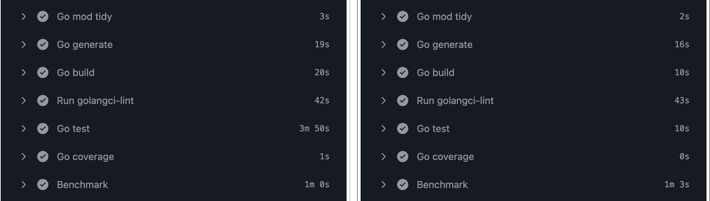

J'ai découvert récemment une fonctionnalité très pratique de Go : la possibilité d'ignorer certains fichiers ou répertoires directement via le fichier `go.mod`, afin d'optimiser le temps d'exécution des builds et des tests.

## Quel est le problème ?

Le tooling Go scanne l'ensemble des fichiers du projet pour déterminer les dépendances et les packages à construire.
Dans un monorepo, ou si vous utilisez des outils comme Bazel, ça peut vite devenir problématique :

- Go va parcourir tous les fichiers contenus dans des dossiers comme `bazel-*`
- Si vous avez un frontend en JavaScript, il va aussi scanner ces fichiers
- Et surtout… le fameux `node_modules`

Inutile de vous faire un dessin : on tombe rapidement dans un trou noir en termes de performance.

Ce problème a été remonté depuis un moment et a été résolu dans Go 1.25 : https://github.com/golang/go/issues/42965

## La solution : ignore dans go.mod

On peut désormais ajouter une directive ignore dans le fichier `go.mod` pour indiquer explicitement quels fichiers ou répertoires doivent être ignorés.

Exemple :
```go
ignore ./node_modules

ignore (
    static
    content/html
    ./third_party/javascript
)
```
Source : https://go.dev/ref/mod#go-mod-file-ignore

## Impact concret

Sur un projet en cours, j'ai mesuré un gain de plus de 3 minutes, soit environ 60% de temps en moins sur les builds et les tests.



C'est loin d'être anecdotique, surtout en CI.

## Petit bonus inattendu

J'ai découvert ça un peu par hasard en migrant un projet de Node vers Bun.

Bun installe ses dépendances dans node_modules/.bun.
Or, Go ignore déjà automatiquement :
- les dossiers commençant par `.`
- et ceux commençant par `_`

Résultat : ce sous-répertoire est ignoré sans aucune configuration supplémentaire.

Plutôt une bonne surprise.

## Conclusion

Si vous avez des répertoires volumineux qui ne concernent pas directement votre code Go (frontend, assets, outils externes, etc.), cette directive peut faire une vraie différence sur vos temps de build et de test.

