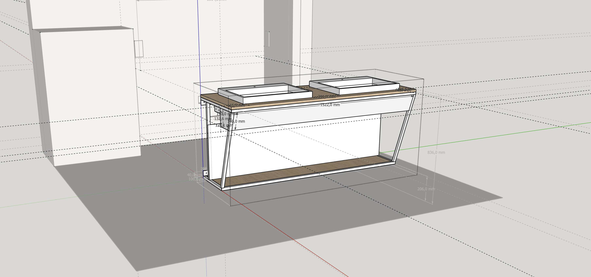
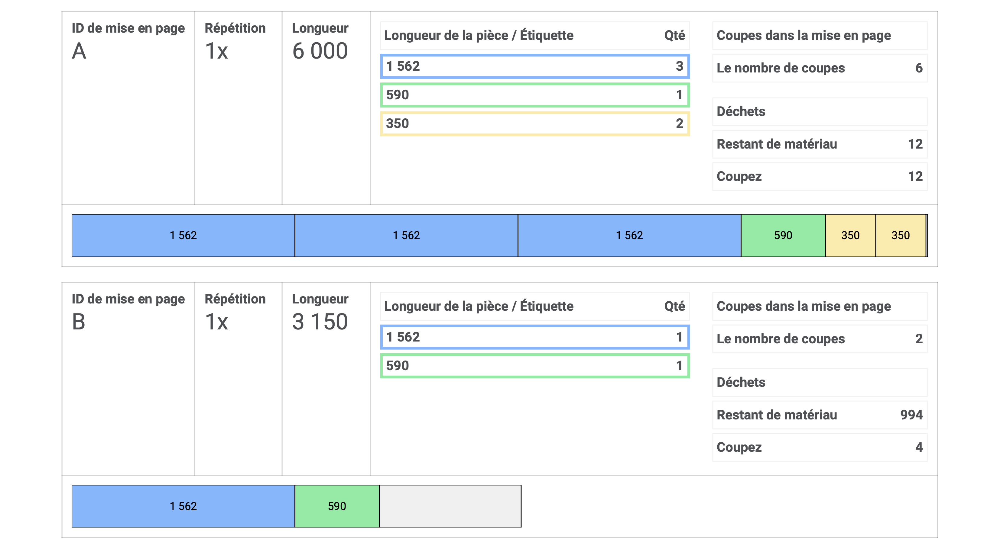

Après une pause de quelques mois (année 😅) dans les travaux de la maison, j'ai décidé d'en finir avec notre salle de bain de la chambre parental.

Au programme un meuble en acier et chêne pour resté dans le theme du [meuble tv en acier et chêne]() que j'avais réalisé il y a quelques années.

<!-- more -->

## Conception

J'utilise toujours [SketchUp](https://www.sketchup.com/fr) pour la conception de mes meubles. C'est un logiciel de modélisation 3D simple et efficace. Il permet de visualiser le meuble en 3D !

J'ai voulu faire un meuble de salle de bain assez simple, avec un plateau en chêne et une structure en acier, pas de tirroir ou de porte, juste une étagère en dessous pour poser des serviettes par exemple et aussi j'ai fait un double fond pour cacher la tuyoauterie.

## Matériaux

Pour le plateau en chêne, j'ai utilisé du 3 plis chêne 19 mm, il m'en resté du panneau que j'avais pris pour faire le [meuble tv]().
Pour la structure en acier, j'ai utilisé des tubes carrés de 20x20 mm et de la tôle d'acier de 1mm (la aussi des reste du meuble tv).

Pour géré mes plan de découpe j'ai utilisé [opticutter](https://www.opticutter.com/).

Voici un aperçu des plan de découpe pour l'acier.

Ne vous basez pas sur ce plan de découpe, il est spécifique a mon stock d'acier que j'avais chez moi.

## Fabrication

Comme toujours, je commence par la découpe des tube d'acier, j'ai utilisé la scie à ruban pour faire les découpes.

Pensé a bien ébavuré les tubes après la découpe, pour éviter de se couper et faire un petit chanfrein pour les soudures.

### Ossature

Après ça, on passe a l'assemblage, pour me simplifier la tache, j'ai utilisé des bouts de bois (chute de terrasse) pour faire des gabarits pour maintenir les tubes en place pendant la soudure.

Bien sur, vérifier que tout est bien d'équerre avant de serré les serre-joint/pinces étaux.

