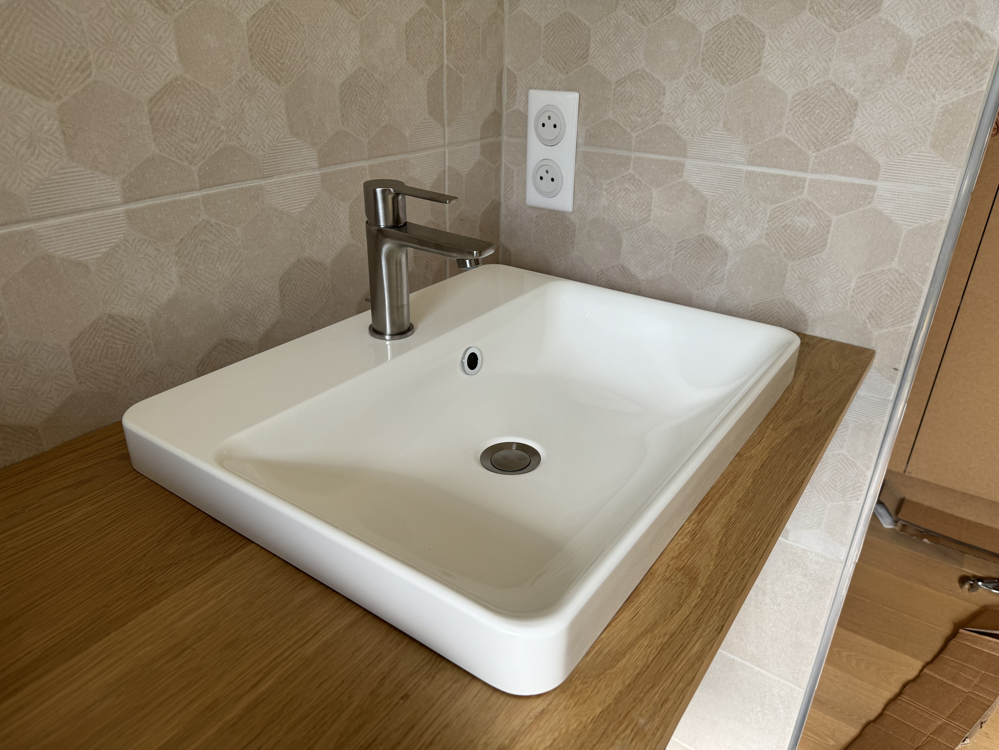

Après une pause de quelques mois (année 😅) dans les travaux de la maison, j'ai décidé d'en finir avec notre salle de bain de la chambre parental.

Au programme, un meuble en acier et chêne pour rester dans le thème du [meuble tv en acier et chêne]() que j'avais réalisé il y a quelques années.

<!-- more -->

## Conception

J'utilise toujours [SketchUp](https://www.sketchup.com/fr) pour la conception de mes meubles. C'est un logiciel de modélisation 3D simple et efficace.

J'ai voulu faire un meuble de salle de bain assez simple, avec un plateau en chêne et une structure en acier, pas de tiroir ou de porte, juste une étagère en dessous pour poser des serviettes par exemple et aussi, j'ai fait un double-fond pour cacher la tuyauterie.

Comme toujours, il est plus simple de modéliser la pièce dans laquelle sera posé le meuble pour avoir une idée de la taille du meuble et des contraintes de la pièce (murs pas droits, plomberie, etc...).

## Matériaux

Pour le plateau, j'ai utilisé du 3 plis chêne 19 mm, il m'en restait du panneau que j'avais pris pour faire le [meuble tv]().
Pour la structure en acier, j'ai utilisé des tubes carrés de 20x20 mm et de la tôle d'acier de 1 mm (là aussi des restes du meuble tv).

Pour gérer mes plans de découpe, j'ai utilisé [opticutter](https://www.opticutter.com/).

Voici un aperçu des plans de découpe pour l'acier.

Ne vous basez pas sur ce plan de découpe, il est spécifique à mon stock d'acier que j'avais chez moi.

## Fabrication

Comme toujours, je commence par la découpe des tubes d'acier, j'ai utilisé la scie à ruban pour faire les découpes.

Pensé a bien ébavuré les tubes après la découpe, pour éviter de se couper et faire un petit chanfrein pour les soudures.

J'ai aussi préparé des platines de fixation pour fixer la structure en acier au mur.

### Ossature

Après ça, on passe à l'assemblage !

Pour me simplifier la tâche, j'ai utilisé des bouts de bois (chute de terrasse) pour faire des gabarits pour maintenir les tubes en place pendant la soudure.

Bien sûr, vérifier que tout est bien d'équerre avant de serrer les serre-joints/pinces étaux.

J'ai utilisé une cale pour maintenir les tubes à la bonne distance !

Ça m'a permis de ne pas avoir à mesurer à chaque fois et d'être sûr que tout soit bien aligné et à la même distance.

Fixation des platines de fixation.

Fixation du bandeau acier, c'est limite du travail de carrossier 😅.

Une fois l'ossature en acier terminée, j'ai présenté l'ossature dans la salle de bain pour vérifier que tout est bien à la bonne taille (j'ai une fâcheuse tendance à faire au mm prêt 😅).

### Traitement de l'acier

Pour traiter l'acier, j'ai utilisé de l'[hématite](https://www.laverdure.fr/oxydation-et-patine-des-mtaux/1804-hematite-1-4l.html), c'est un produit qui permet de patiner l'acier et de le protéger de la rouille sans rajouter d'épaisseur.

Je n'étais pas sûr du résultat, pour l'avoir déjà appliqué sur mon meuble TV, le résultat est assez aléatoire, il faut aller vite pour ne pas avoir de trace d'oxydation trop importante et surtout, il faut rincer à l'eau... sur un meuble de cette taille, ce n'est pas évident.

J'ai appliqué un vernis mat en bombe pour protéger l'acier, contrairement au meuble TV, ou j'avais mis une huile de protection, là, je ne pouvais pas me permettre de mettre une huile sur un meuble de salle de bain, il fallait que ça soit résistant à l'eau.

## Fixation de l'ossature au mur

Pour fixer l'ossature au mur, j'ai utilisé des chevilles pour brique creuse, j'ai fait des trous de 8 mm dans le mur et j'ai mis des chevilles (enfin mes enfants l'ont fait...).

## Plateau en chêne

J'y ai passé beaucoup trop de temps, bien sûr, les murs ne sont pas droits, j'ai dû tabletté le plateau pour qu'il soit bien ajusté au mm prêt..., ça m'a juste pris 3h 😅, mais le résultat est juste top !

### Perçage des vasques

Pour les vasques, j'ai utilisé des vasques à poser, j'ai fait les perçages avec une scie sauteuse (avec un guide, on n'est pas des barbares !).

### Placage des chants

Pour les chants, j'ai utilisé du placage chêne, j'ai utilisé une colle néoprène que j'ai appliquée au pinceau, il faut attendre environs 30 secondes avant de coller le placage, c'est assez rapide, il faut être sûr de son coup, une fois collé, c'est collé !

Un petit coup de ciseaux à bois (cutter...) pour enlever le surplus et un petit coup de ponceuse pour arrondir les angles et c'est fini.

Petit conseil, il faut toujours couper le placage à l'inverse du sens du bois, comme si on voulait aplatir le fil du bois, ça évite que le placage se découpe plus que prévu, au pire ça va suivre le fil du bois vers le haut, du coup ce n'est pas grave, il vaut mieux avoir un petit morceau de placage qui dépasse que d'avoir un morceau qui manque :)

### Traitement du plateau

Pour le plateau, j'ai utilisé un vernis mat, j'ai mis quatre couches, j'ai poncé entre chaque couche avec la ponceuse orbitale.

### Pose des vasques

J'ai posé les vasques à blanc pour vérifier que tout est bien aligné.

Ensuite, j'ai utilisé un joint silicone transparent, j'ai mis un cordon de silicone (bien chargé !) sur le contour du trou de la vasque sur le plateau et j'ai posé la vasque sur le plateau.

J'en ai profité pour faire un joint silicone entre le plateau et le mur, pour éviter que l'eau ne s'infiltre entre le plateau et le mur.

## Conclusion

Je suis assez content du résultat, le meuble est simple, mais il est en accord avec le reste de la maison !

Je ne l'ai pas précisé, mais j'ai aussi fait le plateau et jambage pour les toilettes en chêne, pour avoir un ensemble cohérent.

Je n'ai pas totalement fini, il manque encore les étagères en chêne en dessous du plateau, mais je n'avais plus de chêne en stock, mon ami menuisier doit me fournir ces deux planches de chêne, je mettrais à jour l'article quand ce sera fait.

Il manque aussi le double-fond pour cacher la tuyauterie. Je ne sais pas encore si je le fais en bois noir ou en acier comme c'était prévu initialement, je verrai ça plus tard (le fameux "plus tard" permanent 😅).
